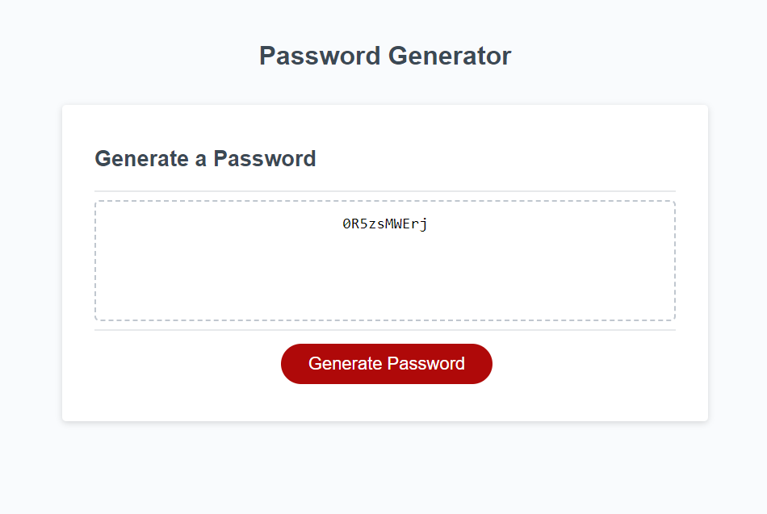

# Refactoring of a Password Generator

## Description
This repository contains the updated source code of a Password Generator, to provide functionality to the page and allow a user to input various options for their passwords creation on top of that. 

## Usage
Access the finalized webpage for the generator with [this link!](https://austinl96.github.io/refactoring-a-password-generator/)

From there, you will be presented with a home page that looks like this:

Once on this page, click the red Generate Password button to be given a series of prompts at the top of the page! You will be presented with multiple options for how you want your password to be made. These options include:

<ul>
<li>Lowercase letters (a-z)</li>
<li>Uppercase letters (A-Z)</li>
<li>Numbers (1-0)</li>
<li>Special Characters (Such as !, ?, #, etc.)</li>
</ul>

Clicking "Ok" when given a prompt adds these character types to the list of options, and "Cancel" will prevent them from being in your final password.

Finally, you will be given a choice of your password's length. You can technically make it as long as you want, but I recommend a minimum of 8 characters for a strong password!

Afterwords your page should look something like this, with a randomly generated password like this depending on your selected options:

## License
N/A